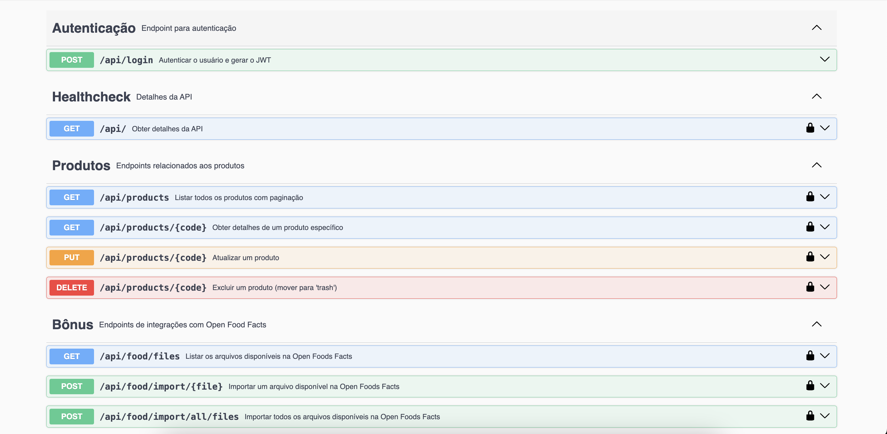

# Backend Challenge 20230105

## Tecnologias Utilizadas
- **Backend**: PHP (Laravel 11)
- **Frontend**: Swagger (Documentação via Swagger UI)
- **Banco de Dados**: SQLite

## Como Rodar o Projeto

### Usando Docker (Recomendado)
1. Clone o repositório:
   ```bash
   git clone <URL_DO_REPOSITORIO>
   ```
2. Navegue até o diretório `api-food`:
   ```bash
   cd api-food
   ```
3. Construa e inicie os containers com Docker:
   ```bash
   docker-compose up --build -d
   ```
4. Copie o arquivo `.env.example` e renomeie-o para `.env`:
   ```bash
   cp .env.example .env
   ```
5. Aguarde de 4 a 8 minutos para que o Docker conclua a instalação das dependências necessárias.
6. Acesse a documentação da API em [http://localhost:8444/api/documentation](http://localhost:8444/api/documentation).
7. Se encontrar problemas, entre no container e reinicie o Apache manualmente:
   ```bash
   docker exec -it <nome_do_container> bash
   service apache2 restart
   ```

### Plano B: Sem Docker
1. Caso tenha problemas com Docker, é necessário ter PHP e Composer instalados localmente.
2. Navegue até o diretório `api-food`:
   ```bash
   cd api-food
   ```
3. Instale as dependências e inicie o servidor:
   ```bash
   composer install
   php artisan serve
   php artisan schedule:work
   ```
4. Acesse a API em [http://localhost:8444/api/documentation](http://localhost:8444/api/documentation).

## Observações e Anotações

1. As importações de produtos dos arquivos `.json` sempre processam as linhas de 1 a 100. Seria interessante alternar as importações para processar registros diferentes em execuções futuras.
2. Foi adicionada uma regra de **insert ou update** no banco de dados: se o código do produto já existir, ele será atualizado em vez de inserido novamente.
3. A API está integrada com Swagger para documentação, e algumas APIs bônus foram adicionadas para facilitar testes.

## Configurações

- **Cron**: A configuração do horário de execução do cron está no arquivo `config/app.php` com a variável `time_execute_cron`, recomendado executar `php artisan config:clear && php artisan config:cache` após a atualização da mesma.
- **Banco de Dados**: O projeto utiliza SQLite pela simplicidade. O arquivo de banco de dados pode ser encontrado em `api-food/database/database.sqlite`, utilizei também as `migrations` para a criação da tabela de produtos.
- **Testes Unitários**: Para rodar os testes, execute:
   ```bash
   php artisan test
   ```
   Os testes estão localizados em `api-food/tests/Unit/ProductControllerTest.php`.
- **JWT**: As APIs utilizam autenticação JWT. As credenciais de login podem ser encontradas no body da API de login.

## Resultado Final



> Este é um desafio da [Coodesh](https://coodesh.com/)
